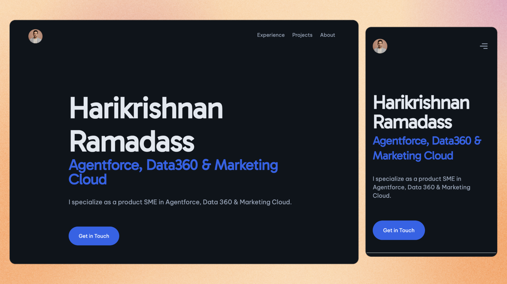

# Harikrishnan Ramadass — Personal Portfolio

A minimalist, accessible and responsive personal portfolio website built with Astro and TailwindCSS.



## 🔥 Features

- [x] Minimalist design — clean and simple
- [x] Mobile-first responsive layout
- [x] SEO-friendly and accessible
- [x] Easy to customize with a single configuration file

## 🚀 Getting Started

Clone this repository to your local machine using Git.

```sh
git clone https://github.com/hariscorpio/hari-portfolio.git
cd hari-portfolio
```

| Command           | Action                                       |
| :---------------- | :------------------------------------------- |
| `npm install`     | Installs dependencies                        |
| `npm run dev`     | Starts local dev server at `localhost:4321`  |
| `npm run build`   | Build your production site to `./dist/`      |
| `npm run preview` | Preview your build locally, before deploying |
